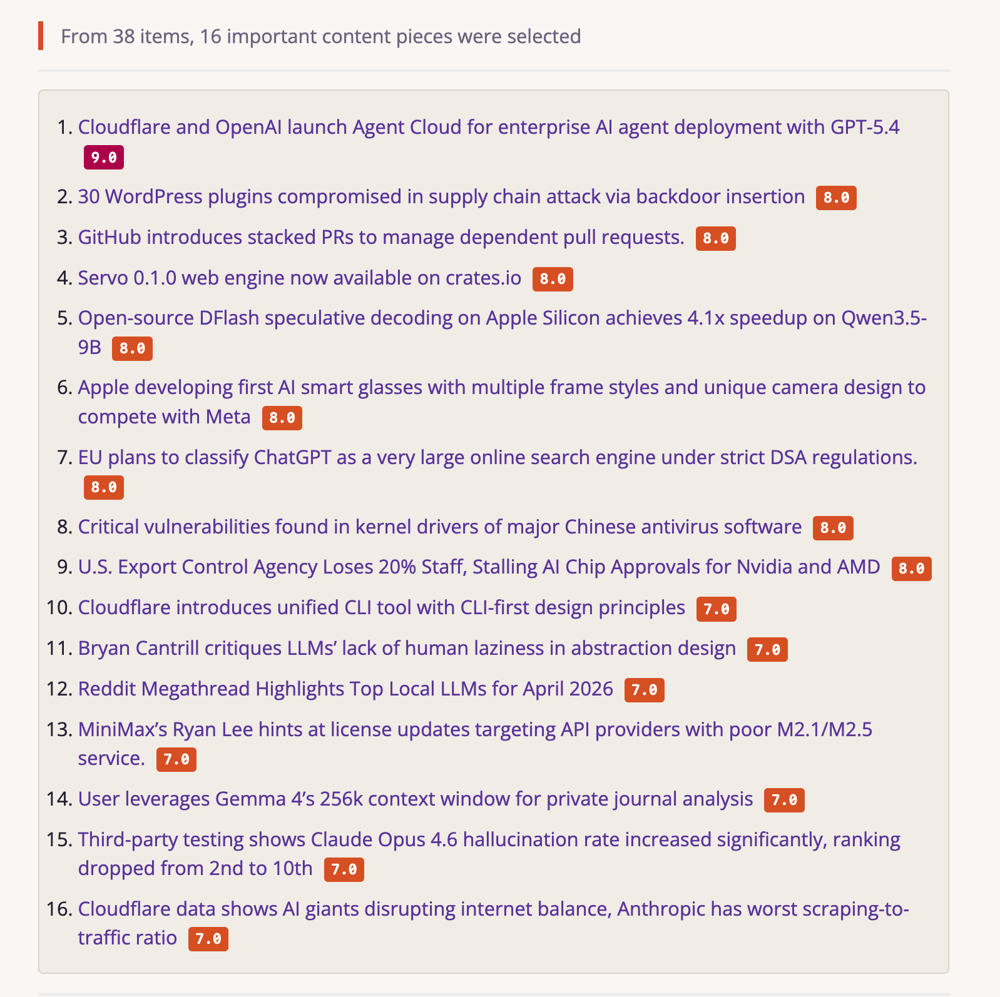
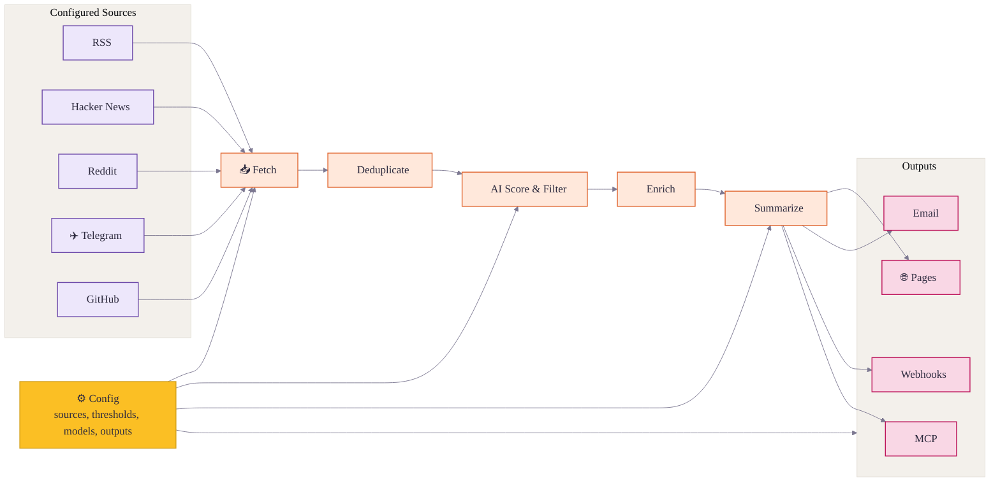
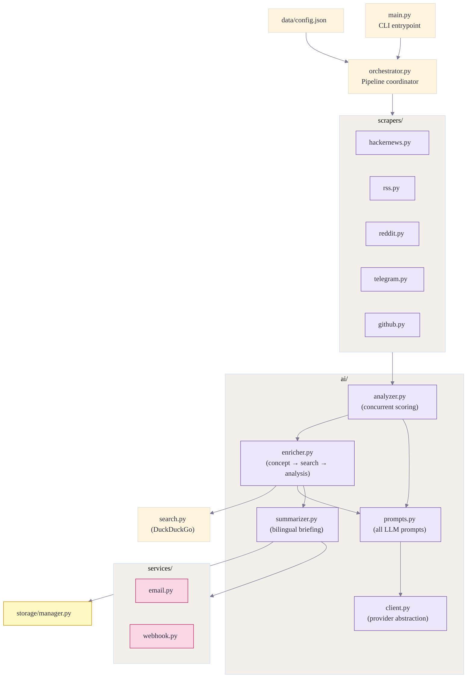

<div align="center">

# 🌅 Horizon

**Enjoy the News itself. Leave others to Horizon**

[](LICENSE)
[](https://github.com/astral-sh/uv)
[](https://thysrael.github.io/Horizon/)
[](https://github.com/Thysrael/Horizon/commits/main)
[](http://makeapullrequest.com)

<a href="https://hellogithub.com/repository/Thysrael/Horizon" target="_blank"></a>
<br>


📡 Your own AI-powered news radar. Generates daily briefings in English & Chinese. | 构建你专属的 AI 新闻雷达

[📖 Live Demo](https://thysrael.github.io/Horizon/) · [📋 Configuration Guide](https://thysrael.github.io/Horizon/configuration) · [简体中文](README_zh.md)

</div>

## Screenshots

<table>
<tr>
<td width="50%">
<p align="center"><strong>Ranked Daily Briefing</strong></p>

</td>
<td width="50%">
<p align="center"><strong>Context, Summary & Discussion</strong></p>

</td>
</tr>
</table>

<details>
<summary><strong>More Screenshots</strong></summary>
<br>
<table>
<tr>
<td width="33.33%">
<p align="center"><strong>Terminal Output</strong></p>

</td>
<td width="33.33%">
<p align="center"><strong>Feishu Notification</strong></p>

</td>
<td width="33.33%">
<p align="center"><strong>Email Delivery</strong></p>

</td>
</tr>
</table>
</details>

## Why Horizon?

Good news is scattered; bad news is endless. Horizon gives you a personal first pass over Hacker News, Reddit, Telegram, RSS, and GitHub: it fetches, deduplicates, scores, filters, and enriches stories with background context and community discussion.

But Horizon is not just another summarizer. AI is great at reducing noise, but news still needs human taste: the sources you trust, the comments that change how you read a story, and the hidden gems only people can share. Horizon keeps that human layer in the loop with customizable sources, thresholds, models, languages, delivery channels, comment summaries, and a community source hub.

## Features

- **📡 Watch Your Own Sources** — Track Hacker News, RSS, Reddit, Telegram, and GitHub releases or user activity in one pipeline
- **🤖 Turn Noise Into a Reading List** — Score each item from 0-10 with Claude, GPT, Gemini, DeepSeek, Doubao, MiniMax, or any OpenAI-compatible API
- **⚡ Concurrent AI Analysis** — Score all items in parallel with a configurable concurrency limit (`ai.concurrency`), dramatically cutting analysis time
- **🎯 Topic-Aware Scoring** — Tell the scorer what to boost or suppress in plain language via `filtering.score_context` — no code changes required
- **🔗 Merge Repeated Stories** — Deduplicate the same story across platforms before it reaches your briefing
- **🔍 Understand the Background** — Add web-researched context for unfamiliar concepts, companies, projects, and technical terms
- **💬 Read the Conversation** — Collect and summarize community comments from Hacker News, Reddit, and other supported sources
- **🌐 Publish in Two Languages** — Generate English and Chinese daily briefings from the same source set
- **📝 Ship a Daily Site** — Publish generated Markdown as a GitHub Pages daily briefing site
- **📧 Deliver by Email** — Run a self-hosted SMTP/IMAP newsletter with automatic subscribe and unsubscribe handling
- **🔔 Push to Chat or Automations** — Send templated results to Feishu/Lark, DingTalk, Slack, Discord, or custom webhook endpoints
- **🧙 Start From Your Interests** — Use the setup wizard to generate a personalized source configuration
- **⚙️ Tune the Radar** — Customize sources, thresholds, models, languages, and delivery channels from one JSON config

## How It Works



1. **Define** — Configure sources, thresholds, models, languages, and delivery from one JSON config.
2. **Fetch** — Pull latest content from all configured sources concurrently.
3. **Deduplicate** — Merge items pointing to the same story or URL across platforms.
4. **Score & Filter** — Use AI to rank items and keep only those above your threshold.
5. **Enrich** — Search the web for background context and collect community discussion for important items.
6. **Summarize** — Generate a structured Markdown briefing with summaries, tags, and references.
7. **Deliver** — Publish the result to GitHub Pages, email, webhooks such as Feishu, MCP, or local files.

## Project Architecture

```
Horizon/
├── src/
│   ├── main.py              # CLI entrypoint — parses args, boots orchestrator
│   ├── orchestrator.py      # Pipeline coordinator — runs all stages in order
│   ├── models.py            # Pydantic data models & config schema
│   ├── search.py            # DuckDuckGo web search used during enrichment
│   ├── ai/
│   │   ├── client.py        # AI provider abstraction (Anthropic / OpenAI / Gemini / …)
│   │   ├── analyzer.py      # Concurrent AI scoring via asyncio.Semaphore + gather
│   │   ├── enricher.py      # Two-pass enrichment: concept extraction → search → analysis
│   │   ├── summarizer.py    # Bilingual daily briefing generation
│   │   ├── prompts.py       # All LLM prompts (scoring, dedup, enrichment, summary)
│   │   └── tokens.py        # Per-provider token usage tracking
│   ├── scrapers/
│   │   ├── base.py          # BaseScraper abstract class
│   │   ├── hackernews.py    # HN via Firebase REST API
│   │   ├── rss.py           # Any RSS / Atom feed via feedparser
│   │   ├── reddit.py        # Reddit public JSON API (no key needed)
│   │   ├── telegram.py      # Public channel web preview scraping
│   │   └── github.py        # GitHub REST API — user events & repo releases
│   ├── services/
│   │   ├── email.py         # SMTP/IMAP self-hosted newsletter
│   │   └── webhook.py       # Feishu / DingTalk / Slack / Discord / generic webhook
│   ├── storage/
│   │   └── manager.py       # File-based storage for summaries & subscriber lists
│   ├── mcp/                 # MCP server — exposes pipeline steps as AI-callable tools
│   └── setup/               # Interactive wizard & preset source library
└── data/
    ├── config.json          # Your configuration (sources, AI model, filtering)
    ├── config.example.json  # Annotated reference config
    ├── presets.json         # Curated source library used by the wizard
    └── summaries/           # Generated daily briefings (Markdown)
```

The data flow through the pipeline:



## Scraping Principles

Each source type uses a different access strategy — no single scraping approach fits all platforms.

### Hacker News

Uses the **[Firebase REST API](https://hacker-news.firebaseio.com/v0/)** — fully public, no authentication required.

1. `GET /topstories.json` → ordered list of up to 500 top story IDs
2. Fetch the top-N story details concurrently (`asyncio.gather`)
3. Filter by `min_score` threshold and the configured time window
4. Fetch the top-K comments for each qualifying story (also concurrent)

Because the HN API is item-by-item, concurrency is essential for acceptable performance.

### RSS / Atom

Uses **[feedparser](https://feedparser.readthedocs.io/)** to parse any standard RSS or Atom feed URL. Feed URLs support `${VAR_NAME}` substitution from `.env` — useful for subscriber-only feeds that embed a secret token in the URL. No authentication headers or browser emulation is needed; feedparser handles encoding quirks automatically.

### Reddit

Uses Reddit's **public JSON API** (`reddit.com/r/{sub}/{sort}.json`) with a browser-style `User-Agent` header — no API key or OAuth required. Post comments are fetched from `/comments/{id}.json`. To avoid triggering rate limits, comment requests are serialized through an `asyncio.Semaphore(2)`.

### Telegram

No API token is needed. Horizon scrapes the **public web preview** at `https://t.me/s/{channel}` using `httpx` + `BeautifulSoup`. The page renders the last ~30 messages as plain HTML; Horizon parses message text, timestamps, and embedded links from the DOM. Only **public channels** are supported.

### GitHub

Uses the **[GitHub REST API](https://docs.github.com/en/rest)**: `/users/{username}/events` for user activity and `/repos/{owner}/{repo}/releases` for release tracking. An optional `GITHUB_TOKEN` in `.env` lifts the unauthenticated rate limit from 60 to 5 000 requests per hour. Only a curated subset of event types is kept (push, create, fork, watch, pull request).

## Quick Start

### 1. Install

**Option A: Local Installation**

```bash
git clone https://github.com/Thysrael/Horizon.git
cd horizon

# Install with uv (recommended)
uv sync

# Or with pip
pip install -e .
```

**Option B: Docker**

```bash
git clone https://github.com/Thysrael/Horizon.git
cd horizon

# Configure environment
cp .env.example .env
cp data/config.example.json data/config.json
# Edit .env and data/config.json with your API keys and preferences

# Run with Docker Compose
docker-compose run --rm horizon

# Or run with custom time window
docker-compose run --rm horizon --hours 48
```

### 2. Configure

**Option A: Interactive wizard (recommended)**

```bash
uv run horizon-wizard
```

The wizard asks about your interests (e.g. "LLM inference", "嵌入式", "web security") and auto-generates `data/config.json`.

**Option B: Manual configuration**

```bash
cp .env.example .env          # Add your API keys
cp data/config.example.json data/config.json  # Customize your sources
```

Minimal manual configuration:

```jsonc
{
  "ai": {
    "provider": "openai",
    "model": "gpt-4",
    "api_key_env": "OPENAI_API_KEY"
  },
  "sources": {
    "rss": [
      { "name": "Simon Willison", "url": "https://simonwillison.net/atom/everything/" }
    ]
  },
  "filtering": {
    "ai_score_threshold": 6.0
  }
}
```

For the full reference, see the [Configuration Guide](docs/configuration.md).

### 3. Run

#### Local Installation

```bash
uv run horizon           # Run with default 24h window
uv run horizon --hours 48  # Fetch from last 48 hours
```

#### With Docker

```bash
docker-compose run --rm horizon           # Run with default 24h window
docker-compose run --rm horizon --hours 48  # Fetch from last 48 hours
```

The generated report will be saved to `data/summaries/`.

### 4. Automate (Optional)

Horizon works great as a **GitHub Actions** cron job. See [`.github/workflows/daily-summary.yml`](.github/workflows/daily-summary.yml) for a ready-to-use workflow that generates and deploys your daily briefing to GitHub Pages automatically.

## Supported Sources

| Source | What it fetches | Comments |
|--------|----------------|----------|
| **Hacker News** | Top stories by score | Yes (top N comments) |
| **RSS / Atom** | Any RSS or Atom feed | — |
| **Reddit** | Subreddits + user posts | Yes (top N comments) |
| **Telegram** | Public channel messages | — |
| **GitHub** | User events & repo releases | — |

## Where Your Briefing Goes

Horizon can publish or deliver the generated briefing in several ways:

| Channel | What it does |
|---------|--------------|
| **GitHub Pages Daily Site** | Copies generated Markdown into `docs/` so GitHub Pages can publish a daily-updated briefing site |
| **Email Subscription** | Sends the daily briefing to subscribers and handles subscribe/unsubscribe requests through SMTP/IMAP |
| **Webhook Notification** | Pushes success or failure results to Feishu/Lark, DingTalk, Slack, Discord, or any custom webhook endpoint |
| **MCP Server** | Exposes Horizon pipeline steps as tools so AI assistants can fetch, score, filter, enrich, summarize, and run the full workflow |

For setup details, see the [Configuration Guide](docs/configuration.md). For MCP tool references and client setup, see [`src/mcp/README.md`](src/mcp/README.md) and [`src/mcp/integration.md`](src/mcp/integration.md).

## Documentation

| Guide | Description |
|-------|-------------|
| [Configuration](docs/configuration.md) | AI providers, sources, filtering, email, webhook, GitHub Pages, and MCP setup |
| [Scoring](docs/scoring.md) | How Horizon evaluates and ranks news items |
| [Scrapers](docs/scrapers.md) | Source scraper details and extension notes |
| [MCP Tools](src/mcp/README.md) | Tool reference for MCP-compatible clients |

## Project Status

Horizon already supports the full daily briefing loop: multi-source collection, AI scoring, deduplication, enrichment, comment summaries, bilingual generation, GitHub Pages publishing, email delivery, webhook delivery, Docker deployment, MCP integration, and the setup wizard.

Planned improvements:

- More source types, such as Twitter/X and Discord
- Custom `score_context` per source (currently one global context)
- Publish releases on GitHub
- Publish the package to PyPI for `pip install`

## Contributing

Contributions are welcome! Feel free to open issues or submit pull requests.

### Share Sources

Want to share valuable source discoveries with the Horizon community? Please submit them through **[horizon1123.top](https://horizon1123.top)**.

Great candidates: niche RSS discoveries, active subreddit trends, notable GitHub updates, or Telegram channel highlights in your area of expertise.

## Acknowledgements

- Special thanks to [LINUX.DO](https://linux.do/) for providing a promotion platform.
- Special thanks to [HelloGitHub](https://hellogithub.com/) for valuable guidance and suggestions.

## License

[MIT](LICENSE)
